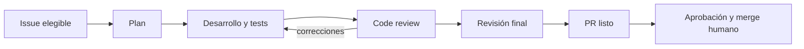
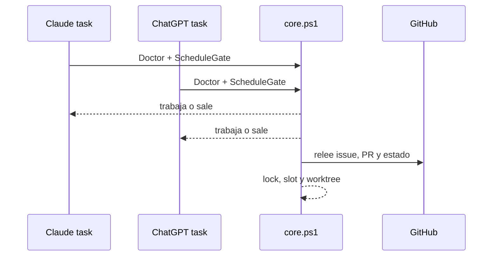

# Chucho AI Loop

Chucho AI Loop instala un loop de entrega para issues de GitHub en un repositorio existente. Un control-plane compartido coordina a Claude y ChatGPT: elige un issue, prepara su worktree, cuida el lock, registra el estado en GitHub y termina con un PR listo para revisión humana.

La primera versión usa PowerShell 7, Git y GitHub CLI (`gh`) para funcionar en Windows, macOS y Linux. No requiere GitHub Projects.



## Inicio rápido

Necesitás PowerShell 7 (`pwsh`), Git y `gh` autenticado contra el repositorio. Cloná el repositorio donde querés trabajar y corré, desde una copia de Chucho AI Loop:

```powershell
$repo = (Resolve-Path '../mi-repo').Path  # Cambiá esta ruta por la de tu repo
pwsh ./install.ps1 -TargetPath $repo -Assistants Claude,ChatGPT -DryRun
pwsh ./install.ps1 -TargetPath $repo -Assistants Claude,ChatGPT
```

El primer comando muestra los cambios. El segundo agrega la configuración, el contrato, el control-plane y las interfaces elegidas, sin pisar archivos que ya editaste. Usá un solo asistente si preferís:

```powershell
pwsh ./install.ps1 -TargetPath $repo -Assistants ChatGPT
```

El instalador completa `repository`, `baseBranch` y `assistants`. Después ajustá `.ai-loop/config.json` con los comandos reales de test. El valor inicial conserva un único issue activo, como máximo tres en espera y `merge.mode: manual`.

```json
{
  "schemaVersion": 1,
  "repository": "owner/repository",
  "baseBranch": "main",
  "testCommands": ["npm test"],
  "activeLimit": 1,
  "pendingLimit": 3,
  "maxReviewRounds": 2,
  "merge": { "mode": "manual", "requiredChecks": [] }
}
```

Revisá los archivos instalados, abrí un PR y mergealo a la rama base. Recién entonces prepará el checkout dedicado para las tareas locales:

```powershell
pwsh ./install.ps1 -TargetPath $repo -BootstrapRunner
```

El comando informa su ubicación. Confirmá la instalación y consultá el control-plane desde ese checkout:

```powershell
$runner = '/ruta/informada/por/bootstrap'
pwsh (Join-Path $runner '.ai-loop/core.ps1') -Command Doctor -Root $runner
pwsh (Join-Path $runner '.ai-loop/core.ps1') -Command Status -Root $runner
```

El instalador también prepara labels y el checkout dedicado para tareas programadas. Cada issue se trabaja en su propio worktree; no uses tu checkout diario como runner.

## Programar el tick

La cadencia recomendada es una vez por hora. El instalador imprime los prompts para crear las tareas; reemplazá `<checkout-dedicado>` por la ubicación informada:

```text
ChatGPT Desktop
En <checkout-dedicado>, atendé un tick de Chucho AI Loop mediante la skill ai-loop-tick. Usá el control-plane compartido y terminá si ScheduleGate no habilita esta ejecución.
```

```text
Claude Desktop
En <checkout-dedicado>, ejecutá /ai-loop-tick. Usá el control-plane compartido y terminá si ScheduleGate no habilita esta ejecución.
```

Para ChatGPT Desktop, agregá el checkout dedicado como proyecto local si todavía no aparece en la app. Creá una tarea programada para ese proyecto y pegá el prompt que entrega el instalador. Elegí la opción que corre **directamente en el proyecto local**: el runner ya es un checkout separado y crea un worktree por issue. Si la tarea abre otro worktree para sí misma, el lock compartido no será el mismo. Las tareas locales necesitan que la computadora esté encendida y la app abierta; ejecutá **Run now** una vez para verificar permisos y la salida. La documentación oficial explica cómo crear y administrar estas tareas en la aplicación de escritorio: [Tareas programadas de ChatGPT](https://learn.chatgpt.com/es-419/docs/automations).

Para Claude Desktop, abrí **Routines → New routine → Local**, elegí el checkout dedicado y pegá el prompt de Claude. Elegí una programación **Hourly** y luego **Run now** para aprobar los permisos que haga falta. Las tareas locales corren en tu máquina solamente mientras Claude Desktop está abierto y el equipo está despierto: [tareas programadas locales de Claude](https://code.claude.com/docs/en/desktop-scheduled-tasks).

Si programás los dos asistentes por hora, los dos pueden despertarse. `ScheduleGate` alterna por hora UTC cuál trabaja; el otro termina sin modificar el repositorio.

Si un tick queda con lock, pausá las dos tareas programadas y revisá `Status`, el proceso y la máquina indicados en `.ai-loop/state/tick.lock`. Cuando confirmes que esa ejecución terminó, borrá sólo ese archivo del runner y reanudá las tareas. El loop no recupera un lock por tiempo automáticamente.



## Cómo decide el loop

Entran issues con una prioridad `priority/P0` a `priority/P3`. Los que tengan `blocked` o `icebox` quedan afuera. GitHub conserva el estado en issues, labels, comentarios y PRs; el estado local del runner queda aislado en el checkout dedicado.

```mermaid
stateDiagram-v2
    planificando --> en-dev
    en-dev --> en-review
    en-review --> corrigiendo
    corrigiendo --> en-review
    en-review --> review-final
    review-final --> espera-merge
    planificando --> necesita-humano
    en-dev --> espera-auto
    en-review --> espera-auto
    review-final --> espera-auto
```

`espera-auto` es una señal que el tick puede consultar de nuevo, como CI. `necesita-humano` detiene el avance hasta que una persona decida. Una label ambigua, PR equivocado, worktree sucio o lock imposible de verificar genera diagnóstico y deja el issue detenido.

La revisión final es profunda y tiene un límite de vueltas. Por defecto termina en `espera-merge`, con PR listo para aprobación y merge humano.

## Merge guarded

Para habilitarlo, configurá checks requeridos en GitHub y reflejalos en `merge.requiredChecks`; después elegí `merge.mode: guarded`. Para un SHA exacto, la revisión final deja este marcador en un comentario del PR:

```html
<!-- ai-loop:merge-authorized issue=N pr=P sha=SHA -->
```

Antes de mergear, el control-plane exige issue y PR asociados, ese marcador para el head actual, ejecuta `testCommands` en el worktree del issue y exige CI verde, cero threads abiertos y worktree limpio. Vuelve a comprobar el SHA tras los tests y repite la validación justo antes del merge. El merge es squash con protección del SHA y se verifica contra GitHub después de ejecutarse. Si falta una señal, queda para una persona.

## Operación

`install.ps1` también ofrece `doctor`, `status` y `upgrade`. Primero usá `-DryRun` para cualquier actualización: muestra archivos nuevos, cambios seguros y archivos editados que conservará. Después de publicar una actualización del loop en la rama base, el runner no se actualiza solo: ejecutá otra vez `pwsh ./install.ps1 -TargetPath $repo -BootstrapRunner` desde la distribución para hacer fast-forward del checkout dedicado.

Las recetas opcionales están en `.ai-loop/recipes/`: detección diaria de issues, auditoría semanal de logging/performance, repriorización semanal y mejora continua. Se conectan a los logs y criterios que decida cada equipo. Pueden proponer o repriorizar trabajo, pero nunca cambian estados del loop por su cuenta.

## Límites de v1

GitHub es el proveedor de issues y PRs. Las tareas programadas son locales y necesitan las aplicaciones y la máquina abiertas. Las routines en nube de Claude y la coordinación entre equipos quedan fuera de esta versión.

## Licencia

[Apache-2.0](LICENSE).
